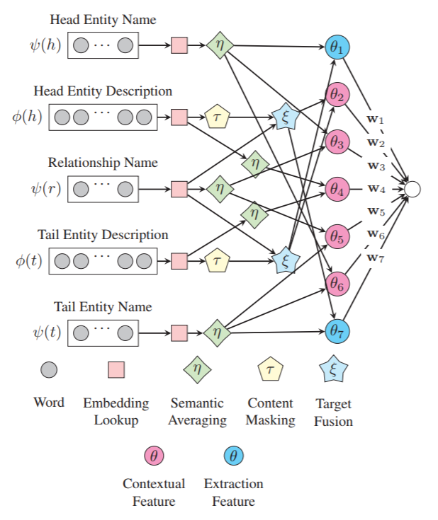
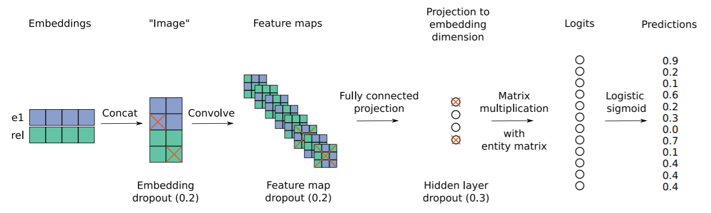
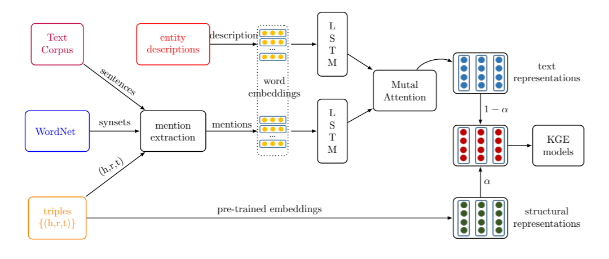
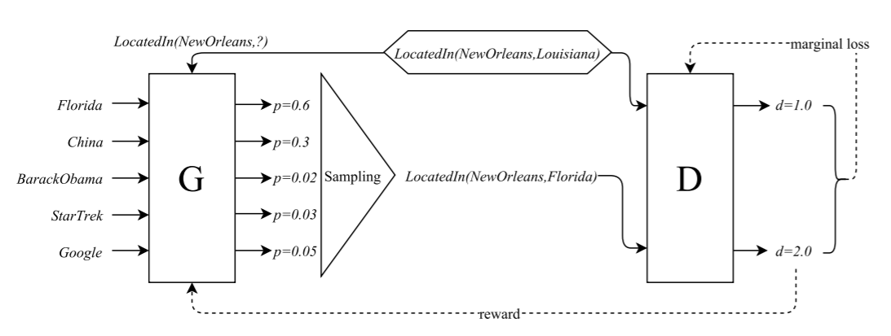
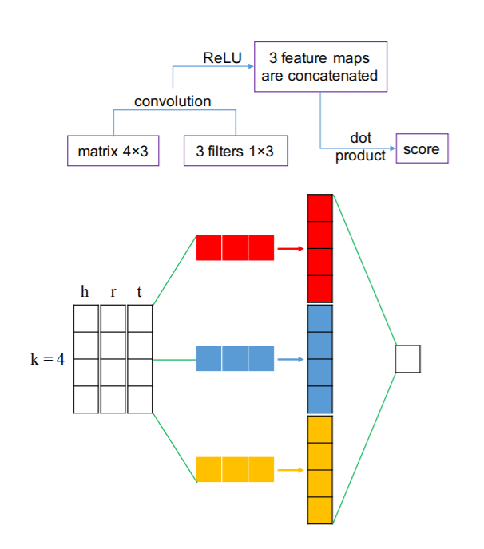
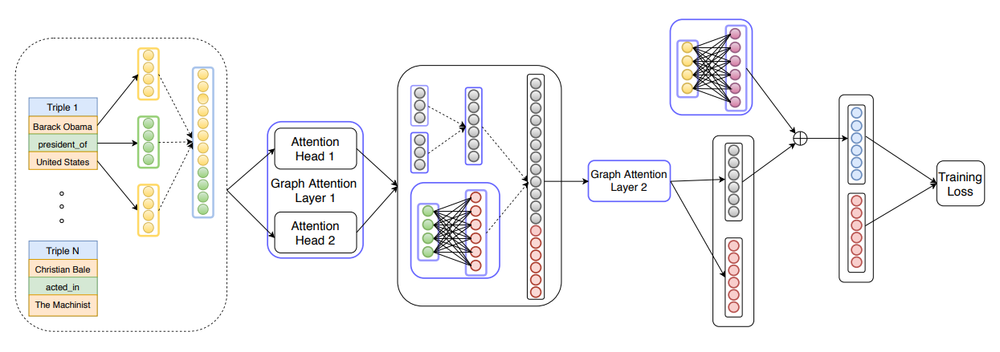
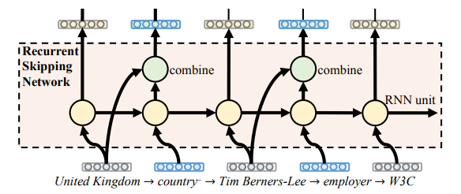
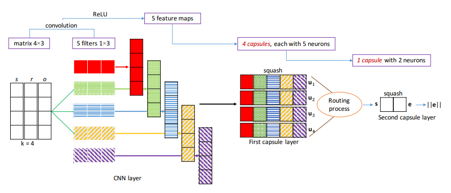

# 语义嵌入表示 - 模型解读 #

### 1. RESCAL 模型 ###

[A Three-Way Model for Collective Learning on Multi-Relational Data](<http://www.icml-2011.org/papers/438_icmlpaper.pdf>) 

描述：将知识图谱编码为一个三位张量，由该三维张量分解出一个核心张量和一个因子矩阵，核心张量每一个二维切片代表一种关系，因子矩阵每一行代表一种实体，核心张量与因子矩阵的还原结果视为对应三元组成立的概率

定义：$\boldsymbol{R}_{k} \in \mathbb{R}^{r \times r}$ 核心张量 k-th 关系的二维切片，$\boldsymbol{A} \in \mathbb{R}^{n \times r}$ 因子矩阵

分解：$\mathcal{X}_{k} \approx \boldsymbol{A} \boldsymbol{R_{k}} \boldsymbol{A}^{\mathrm{T}} (k=1, \ldots, m)$ 

优化：$\min _{A, R_{k}} f\left(\boldsymbol{A}, \boldsymbol{R_{k}}\right)+g\left(\boldsymbol{A}, \boldsymbol{R_{k}}\right)$ 

其中，$f\left(\boldsymbol{A}, \boldsymbol{R_{k}}\right)=\frac{1}{2}\left(\sum_{k}\left\|\mathcal{X}_{k}-\boldsymbol{A} \boldsymbol{R_{k}} \boldsymbol{A}^{\mathrm{T}}\right\|_{F}^{2}\right)$ 损失项，$g\left(\boldsymbol{A}, \boldsymbol{R_{k}}\right)=\frac{1}{2} \lambda\left(\|\boldsymbol{A}\|_{F}^{2}+\sum_{k}\left\|\boldsymbol{R_{k}}\right\|_{F}^{2}\right)$ 正则化项

### 2. SE 模型 ###

[Learning Structured Embeddings of Knowledge Bases](<https://www.aaai.org/ocs/index.php/AAAI/AAAI11/paper/view/3659/3898>) [译文](<http://tongtianta.site/paper/40403>) 

描述：通过关系 r 的两个投影矩阵将头尾两实体 h,t 投影到 d 维空间后计算两实体在关系 r 下的语义相关度，相关度越高代表两实体 h,t 存在关系 r 的可能性越高

定义：$\boldsymbol{l}_{h}, \boldsymbol{l}_{t} \in \mathbb{R}^{d}$ 头尾实体向量表示， $\boldsymbol{M}_{r, 1}, \boldsymbol{M}_{r, 2} \in \mathbb{R}^{d \times d}$ 投影矩阵

评分：$f_{r}(h, t)=\left\|\boldsymbol{M}_{r, 1} \boldsymbol{l}_{h}-\boldsymbol{M}_{r, 2} \boldsymbol{l}_{t}\right\|_{L_{1}/L_{2}}$ 

缺陷：头尾实体使用不同矩阵投影，协同性差，无法精确刻画实体与关系的语义联系

### 3. LFM 模型 ###

[A Latent Factor Model for Highly Multi-relational Data](<http://papers.nips.cc/paper/4744-a-latent-factor-model-for-highly-multi-relational-data.pdf>) 

描述：存在隐特征 m，可通过头实体 h 与隐特征 m 的联系和隐特征 m 与尾实体 t 的联系将头尾实体 h,t 间接起来，h -> m -> t 变换过程代表关系 r。由 h,m 联系的权重和 m,t 联系的权重计算两实体 h,t 存在关系 r 的可能性

定义：$\boldsymbol{l}_{h}, \boldsymbol{l}_{t} \in \mathbb{R}^{d}$ 头尾实体向量表示，$\boldsymbol{M}_{r} \in \mathbb{R}^{d \times d}$ 关系双线性变换矩阵

评分：$f_{r}(h, t)=\boldsymbol{l}_{h}^{\mathrm{T}} \boldsymbol{M}_{r} \boldsymbol{l}_{t}$ 

优势：简单有效刻画实体与关系的语义联系，协同性较好，计算复杂度低

### 4.0. SLM 模型 ###

描述：通过单层神经网络的非线性操作建立实体和关系间的语义联系

定义：$\boldsymbol{u}_{r}^{\mathrm{T}} \in \mathbb{R}^{k}$ 关系向量表示，$\boldsymbol{M}_{r, 1}, \boldsymbol{M}_{r, 2} \in \mathbb{R}^{d \times d}$ 投影矩阵，g(x) 为 tanh 函数

评分：$f_{r}(h, t)=\boldsymbol{u}_{r}^{\mathrm{T}} g\left(\boldsymbol{M}_{r, 1} \boldsymbol{l}_{h}+\boldsymbol{M}_{r, 2} \boldsymbol{l}_{t}\right)$ 

缺陷：提供实体与关系的微弱联系，但引入更高计算复杂度

### 4. NTN 模型 ###

[Reasoning With Neural Tensor Networks for Knowledge Base Completion](<http://papers.nips.cc/paper/5028-reasoning-with-neural-tensor-networks-for-knowledge-base-completion.pdf>) 

描述：用双线性张量层代替标准线性神经网络层，双线性张量层直接在多个维度上关联两个实体

定义：$\boldsymbol{M}_{r} \in \mathbb{R}^{d \times d \times k}$ 三阶张量，NTN 模型中实体向量为实体中所有单词向量的均值（单词数远小于实体数，充分重复利用单词向量来构建实体向量，降低稀疏性，增强实体间语义联系）

评分：$f_{r}(h, t)=\boldsymbol{u}_{r}^{\mathrm{T}} g\left(\boldsymbol{l}_{h} \boldsymbol{M}_{t} \boldsymbol{l}_{t}+\boldsymbol{M}_{r, 1} \boldsymbol{l}_{h}+\boldsymbol{M}_{r, 2} \boldsymbol{l}_{t}+\boldsymbol{b}_{r}\right)$ 

缺陷：计算复杂度高，需要大量三元组，在大规模稀疏知识图谱上效果差

### 5. TransE 模型 ###

TransE 系列模型：[笔记](<https://blog.csdn.net/wp_csdn/article/details/79607727>) [笔记](<https://blog.csdn.net/weixin_40449300/article/details/88771302>) 

[Translating Embeddings for Modeling Multi-relational Data](<http://papers.nips.cc/paper/5071-translating-embeddings-for-modeling-multi-relational-data.pdf>) [笔记](<https://blog.csdn.net/u012052268/article/details/79045477>) [译文](<http://tongtianta.site/paper/40318>) 

灵感：词向量空间、平移不变性

描述：将实体间的关系视为实体间的一种平移操作

定义：$\boldsymbol{l}_{h}, \boldsymbol{l}_{t} \in \mathbb{R}^{d}$ 头尾实体向量表示，$\boldsymbol{l}_{r} \in \mathbb{R}^{d}$ 关系向量表示

评分：$f_{r}(h, t)=\left\|\boldsymbol{l}_{h}+\boldsymbol{l}_{r}-\boldsymbol{l}_{t}\right\|_{L_{1} / L_{2}}$ 

优势：参数少，计算复杂度低，能建立复杂语义联系，在大规模系数知识图谱上效果惊人

缺陷：难以处理复杂关系；实体与关系混在同一个向量空间中

### 6. TransH 模型 ###

[Knowledge Graph Embedding by Translating on Hyperplanes](<https://www.aaai.org/ocs/index.php/AAAI/AAAI14/paper/viewFile/8531/8546>) [笔记](<http://deeplearn-ai.com/2017/11/21/neural-tensor-network-exploring-relations-among-text-entities/?i=3>) 

描述：认为不同关系中实体应该有不同的表示

定义：$\boldsymbol{l}_{h_{r}}=\boldsymbol{l}_{h}-\boldsymbol{w}_{r}^{\mathrm{T}} \boldsymbol{l}_{h} \boldsymbol{w}_{r}$，$\boldsymbol{l}_{t_{r}}=\boldsymbol{l}_{t}-\boldsymbol{w}_{r}^{\mathrm{T}} \boldsymbol{l}_{t} \boldsymbol{w}_{r}$ 

评分：$f_{r}(h, t)=\left\|\boldsymbol{l}_{h_{r}}+\boldsymbol{l}_{r}-\boldsymbol{l}_{t_{r}}\right\|_{L_{1} / L_{2}}$ 

优势：针对不同关系将实体投影到不同超平面有助于建立复杂关系

### 7. TransR 模型 ###

[Learning Entity and Relation Embeddings for Knowledge Graph Completion](<https://www.aaai.org/ocs/index.php/AAAI/AAAI15/paper/view/9571/9523/>) 

描述：认为不同关系拥有不同的语义空间

定义：$\boldsymbol{l}_{h_{r}}=\boldsymbol{l}_{h} \boldsymbol{M}_{r}$，$\boldsymbol{l}_{t_{r}}=\boldsymbol{l}_{t} \boldsymbol{M}_{r}$ 

评分（TransR）：$f_{r}(h, t)=\left\|\boldsymbol{l}_{h_{r}}+\boldsymbol{l}_{r}-\boldsymbol{l}_{t_{r}}\right\|_{L_{1} / L_{2}}$ 

评分（CTransR）：$f_{r}(h, t)=\left\|\boldsymbol{l}_{h_{r}}+\boldsymbol{l}_{r_{c}}-\boldsymbol{l}_{t_{r}}\right\|_{L_{1} / L_{2}}$ 

缺陷：头尾实体共享投影矩阵；投影矩阵只与关系有关；复杂度过高

### 8. TransD 模型 ###

[Knowledge Graph Embedding via Dynamic Mapping Matrix](<https://www.aclweb.org/anthology/P15-1067>) 

描述：提出 (1) 头尾投影矩阵不共享；(2) 实体到关系空间的投影与实体、关系都相关；(3) 投影矩阵由投影向量构造，降低计算复杂度

定义：$\boldsymbol{l}_{h_{\mathrm{p}}}, \boldsymbol{l}_{t_{\mathrm{p}}} \in \mathbb{R}^{d}$，$\boldsymbol{l}_{r_{p}} \in \mathbb{R}^{k}$ 投影向量，$\boldsymbol{M}_{rh}=\boldsymbol{l}_{r_{\mathrm{p}}} \boldsymbol{l}_{h_{\mathrm{p}}}+\boldsymbol{I}^{d \times k}$，$\boldsymbol{M}_{rt}=\boldsymbol{l}_{r_{\mathrm{p}}} \boldsymbol{l}_{t_{\mathrm{p}}}+\boldsymbol{I}^{d \times k}$ 头尾投影矩阵

评分：$f_{r}(h, t)=\left\|\boldsymbol{l}_{h} \boldsymbol{M}_{rh}+\boldsymbol{l}_{r}-\boldsymbol{l}_{t} \boldsymbol{M}_{r t}\right\|_{L_{1} / L_{2}}$ 

优势：利用两个投影向量构造投影矩阵解决参数过多复杂度高的问题

### 9. TransA 模型 ###

[TransA: An Adaptive Approach for Knowledge Graph Embedding](<https://arxiv.org/pdf/1509.05490.pdf>) 

描述：区别对待向量表示的各个维度，对每一维分别学习权重

定义：$\boldsymbol{W}_{r}$ 为权重矩阵，做矩阵分解 $\boldsymbol{W}_{r}=\boldsymbol{L}_{r}^{\mathrm{T}} \boldsymbol{D}_{r} \boldsymbol{L}_{r}$ 

评分：$f_{r}(h, t)=\left(\boldsymbol{l}_{h}+\boldsymbol{l}_{r}-\boldsymbol{l}_{t}\right)^{\mathrm{T}} \boldsymbol{W}_{r}\left(\boldsymbol{l}_{h}+\boldsymbol{l}_{r}-\boldsymbol{l}_{t}\right)=\left(\boldsymbol{L}_{r}|\boldsymbol{l}_{h}+\boldsymbol{l}_{r}-\boldsymbol{l}_{t}|\right)^{\mathrm{T}} \boldsymbol{D}_{r}\left(\boldsymbol{L}_{r}|\boldsymbol{l}_{h}+\boldsymbol{l}_{r}-\boldsymbol{l}_{t}|\right)$ 

### 10. KG2E 模型 ###

[Learning to Represent Knowledge Graphs with Gaussian Embedding](<http://www.nlpr.ia.ac.cn/cip/~liukang/liukangPageFile/Learning to Represent Knowledge Graphs with Gaussian Embedding.pdf>) 

描述：考虑实体和关系的语义本身具有不确定性，使用高斯分布表示实体和关系：$P_{h} \sim N\left(\boldsymbol{\mu}_{h}, \Sigma_{h}\right)$，$P_{t} \sim N\left(\boldsymbol{\mu}_{t}, \Sigma_{t}\right)$，$P_{r} \sim N\left(\boldsymbol{\mu}_{r}, \Sigma_{r}\right)$，$P_{e}=P_{h-t} \sim N\left(\boldsymbol{\mu}_{h}-\boldsymbol{\mu}_{t}, \Sigma_{h}+\Sigma_{t}\right)$，然后根据 $P_{e}$ 与 $P_{r}$ 的相似度进行评分

评分：

(1) KL 距离

$\begin{array}{c}{f_{r}(h, t)=\int_{x \in \mathbb{R}^{k_{e}}} N\left(x ; \boldsymbol{\mu}_{r}, \sum_{r}\right) \log \frac{N\left(x ; \boldsymbol{\mu}_{e}, \sum_{e}\right)}{N\left(x ; \boldsymbol{\mu}_{r}, \sum_{r}\right)} \mathrm{d} x=} \\ {\frac{1}{2}\left\{\operatorname{tr}\left(\sum_{r}^{-1} \sum_{e}\right)+\left(\boldsymbol{\mu}_{e}-\boldsymbol{\mu}_{r}\right)^{\mathrm{T}} \sum_{r}^{-1}\left(\boldsymbol{\mu}_{e}-\boldsymbol{\mu}_{r}\right)-\right.} \\ {\log \frac{\operatorname{det}\left(\sum_{e}\right)}{\operatorname{det}\left(\sum_{r}\right)}+k_{e} \}}\end{array}$ 

(2) 期望概率

$\begin{array}{c}{f_{r}(h, t)=\int_{x \in \mathbb{R}^{k_{e}}} N\left(x ; \boldsymbol{\mu}_{r}, \sum_{r}\right) N\left(x ; \boldsymbol{\mu}_{e}, \sum_{e}\right) \mathrm{d} x=} \\ {\frac{1}{2}\left\{\left(\boldsymbol{\mu}_{e}-\boldsymbol{\mu}_{r}\right)^{\mathrm{T}}\left(\sum_{e}+\sum_{r}\right)^{-1}\left(\boldsymbol{\mu}_{e}-\boldsymbol{\mu}_{r}\right)+\right.} \\ {\log \left(\operatorname{det}\left(\sum_{e}+\sum_{r}\right)\right)+k_{e} \log 2 \pi \}}\end{array}$ 

### 11. DistMult 模型 ###

[Embedding Entities and Relations for Learning and Inference in Knowledge Bases](<https://arxiv.org/pdf/1412.6575.pdf>) [笔记](<https://blog.csdn.net/damuge2/article/details/87990277>) 

描述：双线性模型的特殊形式

定义：$\boldsymbol{M}_{r}=\operatorname{diag}(\boldsymbol{r})$ 

评分：$f_{r}(h, t)=\boldsymbol{l}_{h}^{\mathrm{T}} \boldsymbol{M}_{r} \boldsymbol{l}_{t}$ 

优化：$L(\Omega)=\sum_{\left(e_{1}, r, e_{2}\right) \in T} \sum_{\left(e_{1}^{\prime}, r, e_{2}^{\prime}\right) \in T^{\prime}} \max \left\{S_{\left(e_{1}^{\prime}, r, e_{2}^{\prime}\right)}-S_{\left(e_{1}, r, e_{2}\right)}+1,0\right\}$ 

### 12. PTransE 模型 ###

[Modeling Relation Paths for Representation Learning of Knowledge Bases](<https://arxiv.org/pdf/1506.00379.pdf>) [译文](<http://tongtianta.site/paper/38344>) 

描述：考虑多步关系中路径包含的附加信息，$h \to e_{1} \to \cdots \to e_{n} \to t$ 

三元组：$(h, r_{0}, e_{1}) \cdots (e_{n}, r_{n}, t) \to (h, r_{0} \circ \cdots \circ r_{2}, t)$ 

优化：$L(\mathbf{S})=\sum_{(h, r, t) \in \mathbf{S}}\left[L(h, r, t)+\frac{1}{Z} \sum_{p \in P(h, t)} R(p | h, t) L(p, r)\right]$ 

其中，$R(p | h, t)$ 路径权重/概率/可靠性，$Z=\sum_{p \in P(h, t)} R(p | h, t)$，$L(h, r, t)=\left\|\boldsymbol{l}_{h}+\boldsymbol{l}_{r}-\boldsymbol{l}_{t}\right\|$，$L(h, r, t)=\left\|\boldsymbol{l}_{h}+\boldsymbol{l}_{p}-\boldsymbol{l}_{t}\right\|=\left\|\boldsymbol{l}_{p}-\boldsymbol{l}_{r}\right\|$ 

### 13. RTransE 模型 ###

[Composing Relationships with Translations](<https://www.aclweb.org/anthology/D15-1034>) 

描述：通过相应的翻译向量来模拟关系的组合

定义：$\boldsymbol{l}_{h}, \boldsymbol{l}_{t} \in \mathbb{R}^{d}$ 头尾实体向量表示，$\boldsymbol{l}_{p}=\sum_{i=0}^{p} \boldsymbol{l}_{i} \in \mathbb{R}^{d}$ 组合关系向量表示

评分：$f_{r}(h, t)=\left|\boldsymbol{l}_{h}+\boldsymbol{l}_{p}-\boldsymbol{l}_{t}\right|_{L_{1} / L_{2}}$ 

### 14. ManifoldE 模型 ###

[From One Point to A Manifold: Knowledge Graph Embedding For Precise Link Prediction](<https://arxiv.org/pdf/1512.04792.pdf>) [笔记](<https://www.cnblogs.com/jtianwen2014/p/7018872.html>) 

描述：提出一个基于流形（manifold）的原则，用 $\mathcal{M}(\mathbf{h}, \mathbf{r}, \mathbf{t})=D_{r}^{2}$ 代替 $\boldsymbol{h}_{\boldsymbol{r}}+\boldsymbol{r}=\boldsymbol{t}_{\boldsymbol{r}}$ 

评分：$f_{r}(h, t)=\left\|\mathcal{M}(h, r, t)-D_{r}^{2}\right\|^{2}$，e.g. $\mathcal{M}(h, r, t)=\|\mathbf{h}+\mathbf{r}-\mathbf{t}\|_{2}^{2}$ 

进一步，考虑到球体不易相交，可以以超平面为流形：

$\mathcal{M}(h, r, t)=\left(\mathbf{h}+\mathbf{r}_{\mathrm{head}}\right)^{\mathrm{T}}\left(\mathbf{t}+\mathbf{r}_{\mathrm{tail}}\right)$   或   $\mathcal{M}(h, r, t)=\left|\mathbf{h}+\mathbf{r}_{\mathrm{head}}\right|^{\mathrm{T}}\left|\mathbf{t}+\mathbf{r}_{\mathrm{tail}}\right|$ 

### 15. TransG 模型 ###

[TransG: A Generative Mixture Model for Knowledge Graph Embedding](<https://www.aclweb.org/anthology/P16-1219>) [笔记](<http://coai.cs.tsinghua.edu.cn/en/news/2>) [笔记](<https://www.cnblogs.com/jtianwen2014/p/7000190.html>) 

描述：认为同一关系在语义上也是有所区别的，利用高斯混合模型对一个关系生成多个语义部分，根据三元组的特定语义获得最佳部分，解决关系多语义的问题

定义：$l_{t}-l_{h} | l_{r} \sim \sum_{m=1}^{M} \pi_{r, m} N\left(\boldsymbol{\mu}_{r, m}, \boldsymbol{I}\right)$ 

评分：$\sum_{m=1}^{M_{r}} \pi_{r, m} e^{-\frac{\left\|u_{h}+u_{r, m-u_{t}}\right\|_{2}^{2}}{\sigma_{h}^{2}+\sigma_{t}^{2}}}$ 

### 16. ComplEx 模型 ###

[Complex Embeddings for Simple Link Prediction](<http://proceedings.mlr.press/v48/trouillon16.pdf>) [笔记](<https://blog.csdn.net/tgqdt3ggamdkhaslzv/article/details/79081541>) 

描述：提出复数的表示方法，解决关系中的对称和非对称问题。复数的埃尔米特乘积（Hermitian dot product）不具有交换性

评分：

$\begin{aligned} \phi(r, s, o ; \Theta)=& \operatorname{Re}\left(<w_{r}, e_{s}, \overline{e}_{o}>\right) \\=& \operatorname{Re}\left(\sum_{k=1}^{K} w_{r k} e_{s k} \overline{e}_{o k}\right) \\=&\left\langle\operatorname{Re}\left(w_{r}\right), \operatorname{Re}\left(e_{s}\right), \operatorname{Re}\left(e_{o}\right)\right\rangle \\ &+\left\langle\operatorname{Re}\left(w_{r}\right), \operatorname{Im}\left(e_{s}\right), \operatorname{Im}\left(e_{o}\right)\right\rangle \\ 
&+\left\langle\operatorname{Im}\left(w_{r}\right), \operatorname{Re}\left(e_{s}\right), \operatorname{Im}\left(e_{o}\right)\right\rangle \\
&+\left\langle\operatorname{Im}\left(w_{r}\right), \operatorname{Im}\left(e_{s}\right), \operatorname{Re}\left(e_{o}\right)\right\rangle \end{aligned}$ 

优势：复数的表示方式可以较好地捕捉非对称性关系

### *17. ComplEx+ 模型 ###

[Knowledge Graph Completion via Complex Tensor Factorization](<https://arxiv.org/pdf/1702.06879.pdf>) [译文](<http://tongtianta.site/paper/17066>) 

### 18. HolE 模型 ###

[Holographic Embeddings of Knowledge Graphs](<http://www.aaai.org/ocs/index.php/AAAI/AAAI16/paper/view/12484/11828>) 

描述：提出头尾实体向量“循环相关”操作表示实体对

循环相关：$\left[\boldsymbol{l}_{h} * \boldsymbol{l}_{t}\right]_{k}=\sum_{i=0}^{d-1} \boldsymbol{l}_{h_{i}} \boldsymbol{l}_{t_{(i+k)} \bmod d}$；优化操作：$\boldsymbol{l}_{h} * \boldsymbol{l}_{t}=F^{-1}\left(\overline{F}\left(\boldsymbol{l}_{h}\right) \odot F\left(\boldsymbol{l}_{t}\right)\right)$ 

评分：$f_{r}(h, t)=\sigma\left(\boldsymbol{l}_{r}^{\mathrm{T}}\left(\boldsymbol{l}_{h} * \boldsymbol{l}_{t}\right)\right)$ 

优势：不可交换性解决非对称关系问题；循环相关操作每一维都衡量了头尾实体的某种相似性

### *19. KR-EAR 模型 ###

[Knowledge Representation Learning with Entities, Attributes and Relations](<http://nlp.csai.tsinghua.edu.cn/~lyk/publications/ijcai2016_krear.pdf>) 

描述：提出利用实体、属性、关系三个元素来进行表示学习，首次关注到属性与关系的区别

### 20. TranSpare 模型 ###

[Knowledge Graph Completion with Adaptive Sparse Transfer Matrix](<http://www.aaai.org/ocs/index.php/AAAI/AAAI16/paper/view/11982/11693>) 

描述：针对不同难度的实体间关系，使用不同稀疏程度的矩阵（不同数量的参数）来进行表征，对头尾两种实体采用不同的投影矩阵

**异质性** 

关系复杂度：$\theta_{r}=1-\left(1-\theta_{\min }\right) N_{r} / N_{r^{*}}$ 

其中，$r^{*}$ 连接实体数最多的关系，$N_{r^{*}}$ 为其连接实体的数量，$\theta_{min}$ 超参，描述关系 $r^{*}$ 稀疏程度

评分：$f_{r}(h, t)=\left\|h_{p}+r-t_{p}\right\|_{2}^{2}=\left\|M_{r}\left(\theta_{r}\right) h+r-M_{r}\left(\theta_{r}\right) t\right\|_{2}^{2}$ 

**不均衡性** 

关系复杂度：$\theta_{r}^{l}=1-\left(1-\theta_{\min }\right) N_{r}^{l} / N_{r^{*}}^{l^{*}}$

使用超参 $\theta_{r}^{h}$ $\theta_{r}^{t}$ 分别描述头尾实体映射矩阵的稠密程度

评分：$f_{r}(h, t)=\left\|h_{p}+r-t_{p}\right\|_{2}^{2}=\left\|M_{r}^{h}\left(\theta_{r}^{h}\right) h+r-M_{r}^{t}\left(\theta_{r}^{t}\right) t\right\|_{2}^{2}$ 

优势：根据关系复杂度采用不同数量的参数解决异质性；头尾实体采用不同投影矩阵解决不均衡性

### *21. TKRL 模型 ###

[Representation Learning of Knowledge Graphs with Hierarchical Types](<http://nlp.csai.tsinghua.edu.cn/~lzy/publications/ijcai2016_tkrl.pdf>) 

描述：融入实体类型信息辅助知识图谱的表示学习

### *22. TEKE 模型 ###

[Text-Enhanced Representation Learning for Knowledge Graph](<https://www.ijcai.org/Proceedings/16/Papers/187.pdf>) 

描述：利用外部文本中的上下问信息辅助知识图谱的表示学习

### 23. STransE 模型 ###

[STransE: A Novel Embedding Model of Entities and Relationships in Knowledge Bases](<https://arxiv.org/pdf/1606.08140.pdf>) 

描述：SE 模型与 TransE 模型的简单组合

评分：$f_{r}(h, t)=\left\|\mathbf{W}_{r, 1} \mathbf{h}+\mathbf{r}-\mathbf{W}_{r, 2} \mathbf{t}\right\|_{L_{1}/L_{2}}$

### 24. GAKE 模型 ###

[GAKE: Graph Aware Knowledge Embedding](<http://yangy.org/works/gake/gake-coling16.pdf>) 

描述：基于图的知识嵌入表示方法，利用图的结构信息学习顶点或边的嵌入表示

三种图形上下文：Neighbor Context，Edge Context，Path Context

定义1：知识图 $G=\left( V, E \right)$ 

定义2：给定 $s_{i}$，其上下文 $C\left( s_{i} \right): \left\{s_{w} | s_{w} \in S, s_{w} \text { relevant to } s_{i}\right\}$ 

标记：$s=(t, k)$，$t$ - 类型（0 为顶点 1 为边），$k$ - 索引 

$O_{N}=\sum_{s_{i} \in S} \sum_{c_{N}\left(s_{i}\right) \in C_{N}\left(s_{i}\right)} \log p\left(s_{i} | c_{N}\left(s_{i}\right)\right)$ 

$O_{P}=\sum_{s_{i} \in S} \sum_{c_{P}\left(s_{i}\right) \in C_{P}\left(s_{i}\right)} \log p\left(s_{i} | c_{P}\left(s_{i}\right)\right)$ 

$O_{E}=\sum_{s_{i} \in S} \log p\left(s_{i} | c_{E}\left(s_{i}\right)\right)$ 

目标函数：$O=\lambda_{N} O_{N}+\lambda_{P} O_{P}+\lambda_{E} O_{E}$ 

### 25. DKRL 模型 ###

[Representation Learning of Knowledge Graphs with Entity Descriptions](<https://aaai.org/ocs/index.php/AAAI/AAAI16/paper/view/12216/12004>) [译文](<https://blog.csdn.net/u012052268/article/details/79069062>) 

描述：考虑实体描述信息的表示学习

两种模型：CBOW 和 CNN

定义：$l_{h_{s}}, l_{t_{s}}$ 基于结构的表示，$l_{h_{d}}, l_{t_{d}}$ 基于描述的表示

评分：$E=E_{S}+E_{D}$ 

其中，$E_{S}=\left\|l_{h_{s}}+l_{r}-l_{t_{s}}\right\|$，$E_{D}=E_{D D}+E_{D S}+E_{S D}=\left\|l_{h_{d}}+l_{r}-l_{t_{d}}\right\|+\left\|l_{h_{d}}+l_{r}-l_{t_{s}}\right\|+\left\|l_{h_{s}}+l_{r}-l_{t_{d}}\right\|$ 

优势：提升实体表示的区分能力，能表示新实体

### *26. ProPPR 模型 ###

[Learning First-Order Logic Embeddings via Matrix Factorization](<https://sites.cs.ucsb.edu/~william/papers/ijcai2016.pdf>) 

### 27. SSP 模型 ###

[SSP: Semantic Space Projection for Knowledge Graph Embedding with Text Descriptions](<http://www.aaai.org/Conferences/AAAI/2017/PreliminaryPapers/14-XiaoH-14306.pdf>) 

描述：结合符号三元组和文本描述信息的语义空间投影模型

评分：$f_{r}(h, t)=-\lambda\left\|\mathbf{e}-\mathbf{s}^{\top} \mathbf{e s}\right\|_{2}^{2}+\|\mathbf{e}\|_{2}^{2}$ 

其中，$\mathbf{e} \doteq \mathbf{h}+\mathbf{r}-\mathbf{t}$，$\mathbf{s} \doteq \mathcal{S}\left(\mathbf{s}_{\mathbf{h}}, \mathbf{s}_{\mathbf{t}}\right)$ ，$\mathcal{S}\left(\mathbf{s}_{\mathbf{h}}, \mathbf{s}_{\mathbf{t}}\right)=\frac{\mathbf{s}_{h}+\mathbf{s}_{t}}{\left\| \mathbf{s}_{h}+\mathbf{s}_{t} \right\|_{2}^{2}}$ 

### 28. ProjE 模型 ###

[ProjE: Embedding Projection for Knowledge Graph Completion](<https://www.aaai.org/ocs/index.php/AAAI/AAAI17/paper/view/14279/13906>) 

描述：共享变量神经网络模型，包括组合层与投影

组合操作：$\mathbf{e} \oplus \mathbf{r}=\mathbf{D}_{e} \mathbf{e}+\mathbf{D}_{r} \mathbf{r}+\mathbf{b}_{c}$ 

嵌入投影函数：$h\left(\mathbf{e}, \mathbf{r}\right)=g\left(\mathbf{W}^{c}f\left( \mathbf{e} \oplus \mathbf{r} \right)+b_{p}\right)$ 

### 29. ANALOGY 模型 ###

[Analogical Inference for Multi-relational Embeddings](<https://arxiv.org/pdf/1705.02426.pdf>) [笔记](<https://zhuanlan.zhihu.com/p/36982368>) 

描述：利用 KG 的类比结构，提出线性映射的可交换性

可交换性： $r \circ r'=r' \circ r$， $W_{r \circ r'}=W_{r}W_{r'}=W_{r'}W_{r}=W_{r' \circ r}$  

评分：$\phi(s, r, o)=\left\langle v_{s}^{\top} W_{r}, v_{o}\right\rangle= v_{s}^{\top} W_{r} v_{o}$ 

优化：$\min _{v, W} \mathbb{E}_{s, r, o, y \sim \mathcal{D}} \ell\left(\phi_{v, W}(s, r, o), y\right)$ 

### 30. IKRL 模型 ###

[Image-embodied Knowledge Representation Learning](<https://www.ijcai.org/proceedings/2017/0438.pdf>) [译文](<http://tongtianta.site/paper/20865>) [笔记](<http://www.sohu.com/a/161602745_500659>) 

描述：融合实体图像的知识表示学习模型，首次在知识表示中引入图像信息

定义：$l_{h_{s}}, l_{t_{s}}$ 基于结构的表示，$l_{h_{d}}, l_{t_{d}}$ 基于图像的表示

评分：$E=E_{SS}+E_{SI}+E_{IS}+E_{II}$ 

其中，$E_{SS}=\left\|l_{h_{s}}+l_{r}-l_{t_{s}}\right\|$，$E_{SI}=\left\|l_{h_{s}}+l_{r}-l_{t_{i}}\right\|$，$E_{IS}=\left\|l_{h_{i}}+l_{r}-l_{t_{s}}\right\|$，$E_{II}=\left\|l_{h_{i}}+l_{r}-l_{t_{i}}\right\|$ 

### 31. ITransF 模型 ###

[An Interpretable Knowledge Transfer Model for Knowledge Base Completion](<https://arxiv.org/pdf/1704.05908.pdf>) 

描述：发现并共享关系投影矩阵间的统计规律（隐藏概念），缓解大多数关系数据稀疏的问题

定义：$D \in \mathbb{R}^{m \times n \times n}$ 三维张量，m 超参，预置概念数，$\boldsymbol{\alpha}_{r}^{H}, \boldsymbol{\alpha}_{r}^{T} \in[0,1]^{m}$  稀疏注意力向量

评分：$f_{r}(h, t)=\left\|\boldsymbol{\alpha}_{r}^{H} \cdot \mathbf{D} \cdot \mathbf{h}+\mathbf{r}-\boldsymbol{\alpha}_{r}^{T} \cdot \mathbf{D} \cdot \mathbf{t}\right\|_{\ell}$ 

### 32. RUGE 模型 ###

[Knowledge Graph Embedding with Iterative Guidance from Soft Rules](<https://arxiv.org/pdf/1711.11231.pdf>) [笔记](<https://blog.csdn.net/weixin_38358881/article/details/83017000>) [笔记](<http://blog.openkg.cn/论文浅尝-kg-embedding-with-iterative-guidance-from-soft-rules/>) 

描述：规则引导嵌入，借助软规则的迭代引导完成知识表示学习

软规则预测：

$\begin{array}{c}{\min _{\mathcal{S}, \boldsymbol{\xi}} \frac{1}{2} \sum_{x_{u} \in \mathcal{U}}\left(s\left(x_{u}\right)-\phi\left(x_{u}\right)\right)^{2}+C \sum_{p, q} \xi_{p q}} \\ {\text { s.t. } \quad \lambda_{p}\left(1-\pi\left(g_{p q} | \mathcal{S}\right)\right) \leq \xi_{p q}, q=1, \cdots, Q_{p}, p=1, \cdots, P} \\ {\xi_{p q} \geq 0, q=1, \cdots, Q_{p}, p=1, \cdots, P} \\ {0 \leq s\left(x_{u}\right) \leq 1, \forall s\left(x_{u}\right) \in \mathcal{S}}\end{array}$ 

嵌入修正：

$\min _{\Theta} \frac{1}{|\mathcal{L}|} \sum_{\mathcal{L}} \ell\left(\phi\left(x_{\ell}\right), y_{\ell}\right)+\frac{1}{|\mathcal{U}|} \sum_{\mathcal{U}} \ell\left(\phi\left(x_{u}\right), s\left(x_{u}\right)\right)$ 

### 33. ConMask 模型 ###

[Open-World Knowledge Graph Completion](<https://www.aaai.org/ocs/index.php/AAAI/AAAI18/paper/viewFile/16055/15901>) [笔记](<http://blog.openkg.cn/论文浅尝-基于开放世界的知识图谱补全/>) [笔记](<https://www.jiqizhixin.com/articles/2018-05-09-6>) 

描述：解决遇到不存在的实体或关系时的知识库补全问题

三组件：Context Masking，Target Fusion，Semantic Averaging

Context Masking：$\tau(\phi(e), \psi(r))=\mathbf{W}_{\phi(e)} \circ f_{w}\left(\mathbf{W}_{\phi(e)}, \mathbf{W}_{\psi(r)}\right)$ 

Target Fusion：FCN

Semantic Averaging：$\eta(\mathbf{W})=\frac{1}{k_{l}} \Sigma_{i}^{k_{l}} \mathbf{W}_{[i ; :]}$ 

损失：

$\mathcal{L}(h, r, t)=\left\{\begin{array}{l}{\sum_{h_{+} \in E^{+}}-\frac{\log \left(S\left(h_{+}, r, E^{+} \cup E^{-}\right)\right)}{\left|E^{+}\right|}, p_{c}>0.5} \\ {\sum_{t_{+} \in E^{+}}-\frac{\log \left(S\left(h, r, t_{+}, E^{+} \cup E^{-}\right)\right)}{\left|E^{+}\right|}, p_{c} \leq 0.5}\end{array}\right.$ 

### *34. TorusE 模型 ###

[TorusE: Knowledge Graph Embedding on a Lie Group](<https://aaai.org/ocs/index.php/AAAI/AAAI18/paper/viewFile/16227/15885>) 

### *35. 双线性模型 ###

[On Multi-Relational Link Prediction with Bilinear Models](<https://aaai.org/ocs/index.php/AAAI/AAAI18/paper/viewFile/16900/16722>) 

描述：各种双线性模型的总结、集成

### 36. ConvE 模型 ###

[Convolutional 2D Knowledge Graph Embeddings](<https://aaai.org/ocs/index.php/AAAI/AAAI18/paper/viewFile/17366/15884>) [笔记](<https://blog.csdn.net/damuge2/article/details/87974995>) [笔记](<https://zhuanlan.zhihu.com/p/34963213>) [笔记](<https://www.jiqizhixin.com/articles/2018-05-09-6>) 

描述：采用多层神经网络模型进行知识表示学习，增加模型提取深层特征的能力

评分：$\psi_{r}\left(\mathbf{e}_{s}, \mathbf{e}_{o}\right)=f\left(\operatorname{vec}\left(f\left(\left[\overline{\mathbf{e}}_{s} ; \overline{\mathbf{r}_{r}}\right] * \omega\right)\right) \mathbf{W}\right) \mathbf{e}_{o}$ 

优势：参数利用率高

### 37. 精确文本增强 ###

[Accurate Text-Enhanced Knowledge Graph Representation Learning](<https://aclweb.org/anthology/N18-1068>) 

描述：提出关系说明与实体描述间的相互注意力机制，以学习更精确的文本表示

步骤：提取三元组的精确文本说明，学习基于文本的表示、文本增强表示学习

### 38. KBGAN 模型 ###

[KBGAN: Adversarial Learning for Knowledge Graph Embeddings](<https://aclweb.org/anthology/N18-1133>) [译文](<http://tongtianta.site/paper/17506>) [笔记](<http://ir.dlut.edu.cn/news/detail/552>) 

描述：将 GANs 与 Knowledge Graph Embeddings (KGE) 相结合提高 KGE 效率

模型：生成器、鉴别器（可以是 TransE、TransD、ComplEx 等预训练语义嵌入模型）

### 39. ConvKB 模型 ###

[A Novel Embedding Model for Knowledge Base Completion Based on Convolutional Neural Network](<https://aclweb.org/anthology/N18-2053>) 

描述：采用卷积神经网络，能够捕捉知识库中实体与关系间的全局联系和过渡特征

### *40. R-GCN 模型 ###

[Modeling Relational Data with Graph Convolutional Networks](<https://arxiv.org/pdf/1703.06103.pdf>) [笔记](<https://lanzhuzhu.github.io/2017/04/30/IE/RelationExtraction/Modeling Relational Datawith Graph Convolutional Networks/>) [笔记](<https://blog.csdn.net/luoxuexiong/article/details/88998192>) [GCN](<https://www.zhihu.com/question/54504471/answer/630639025>) 

描述：首个使用 GCN 框架建模关系数据，并提出一种参数共享的方法

### 41. 简单约束 ###

[Improving Knowledge Graph Embedding Using Simple Constraints](<https://aclweb.org/anthology/P18-1011>) [笔记](<https://blog.csdn.net/sjh18813050566/article/details/86647616>) 

描述：通过加入简单约束提高 Knowledge Graph Embeddings (KGE) 效果

两个约束：非负约束、近似推理约束

非负约束：记录信息时，仅记录正向信息更高效。e.g “猫是哺乳动物”比“猫不是爬行动物”更高效

近似推理约束：$r_{1} \to r_{2}$，表现为 $score(h, r_{1}, t) \le score(h, r_{2}, t)$，这是绝对推理。近似推理则引入置信度 $\lambda$ 并放宽边界条件 $score_{1}-score_{2} \le a / \lambda$ 

### 42. TransC 模型 ###

[Differentiating Concepts and Instances for Knowledge Graph Embedding](<https://arxiv.org/pdf/1811.04588.pdf>) [译文](<http://tongtianta.site/paper/6185>) 

描述：区分概念与实例，将概念表示为一个球体，实例表示为向量

关系：InstanceOf、SubClassOf、Relational Triple

评分：

InstanceOf：$f_{e}(i, c)=\|\mathbf{i}-\mathbf{p}\|_{2}-m$ 

SubClassOf：

$f_{c}\left(c_{i}, c_{j}\right)=\left\|\mathbf{p}_{i}-\mathbf{p}_{j}\right\|_{2}+m_{i}-m_{j}$   (separate)

$f_{c}\left(c_{i}, c_{j}\right)=\left\|\mathbf{p}_{i}-\mathbf{p}_{j}\right\|_{2}+m_{i}-m_{j}$   (intersects)

$f_{c}\left(c_{i}, c_{j}\right)=m_{i}-m_{j}$   (inside)

Relational Triple：$f_{r}(h, t)=\left\|\boldsymbol{l}_{h}+\boldsymbol{l}_{r}-\boldsymbol{l}_{t}\right\|_{2}$ 

优化：$\mathcal{L}=\mathcal{L}_{e}+\mathcal{L}_{c}+\mathcal{L}_{l}$ 

$\mathcal{L}_{e}=\sum_{\xi \in \mathcal{S}_{e}} \sum_{\xi^{\prime} \in \mathcal{S}_{e}^{\prime}}\left[\gamma_{e}+f_{e}(\xi)-f_{e}\left(\xi^{\prime}\right)\right]_{+}$ 

$\mathcal{L}_{c}=\sum_{\xi \in \mathcal{S}_{c}} \sum_{\xi^{\prime} \in \mathcal{S}_{c}^{\prime}}\left[\gamma_{c}+f_{c}(\xi)-f_{c}\left(\xi^{\prime}\right)\right]_{+}$ 

$\mathcal{L}_{l}=\sum_{\xi \in \mathcal{S}_{l}} \sum_{\xi^{\prime} \in \mathcal{S}_{l}^{\prime}}\left[\gamma_{l}+f_{l}(\xi)-f_{l}\left(\xi^{\prime}\right)\right]_{+}$ 

### 43. SimplE 模型 ###

[SimplE Embedding for Link Prediction in Knowledge Graphs](<https://www.cs.ubc.ca/~poole/papers/Kazemi_Poole_SimplE_NIPS_2018.pdf>) [译文](<http://tongtianta.site/paper/1373>) 

描述：简化的张量因子分解模型

张量分解方法：平移、深度学习、乘法

定义：$h_{e}, t_{e} \in \mathbb{R}^{d}$ 实体向量，$v_{r}, v_{r^{-1}} \in \mathbb{R}^{d}$ 关系向量

评分：$\frac{1}{2}\left(\left\langle h_{e_{i}}, v_{r}, t_{e_{j}}\right\rangle+\left\langle h_{e_{j}}, v_{r^{-1}}, t_{e_{i}}\right\rangle\right)$ 

### 44. RotatE 模型 ###

[RotatE: Knowledge Graph Embedding by Relational Rotation in Complex Space](<https://openreview.net/pdf?id=HkgEQnRqYQ>) [笔记](<http://www.sohu.com/a/330009300_500659>) 

灵感：欧拉恒等式

描述：可以推断各种关系模式，将每个关系定义为复杂向量空间中从源实体到目标实体的旋转

关系模式：对称/反对称，逆和组合

对称/反对称：$r(x, y) \to r(y, x)$，$r(x, y) \to \neg r(y, x)$ 

逆：$r(x, y) \to r^{-1}(y, x)$ 

组合：$r_{1}(x, y) \and r_{2}(y, z) \to r(x, z)$ 

评分：$d_{r}(h, t)=\left\|\boldsymbol{l}_{h} \circ \boldsymbol{l}_{r}-\boldsymbol{l}_{t}\right\|_{2}$ 

### 45. TuckER 模型 ###

[TuckER: Tensor Factorization for Knowledge Graph Completion](<https://arxiv.org/pdf/1901.09590.pdf>) [笔记](<https://blog.csdn.net/tgqdt3ggamdkhaslzv/article/details/88630679>) 

描述：基于 Tucker 分解知识图三元组的二元张量表示。将张量分解为一个核心张量与三个矩阵

定义：$\mathcal{Z} \in \mathbb{R}^{I \times J \times K}$ 核心张量，$A \in \mathbb{R}^{I \times P}$ $B \in \mathbb{R}^{J \times Q}$ $C \in \mathbb{R}^{K \times R}$ 因子矩阵

分解：$\mathcal{X} \approx \mathcal{Z} \times_{1} \mathbf{A} \times_{2} \mathbf{B} \times_{3} \mathbf{C}=\sum_{p=1}^{P} \sum_{q=1}^{Q} \sum_{r=1}^{R} z_{p q r} \mathbf{a}_{p} \otimes \mathbf{b}_{q} \otimes \mathbf{c}_{r}$ 

评分：$\phi\left(e_{s}, r, e_{o}\right)=\mathcal{W} \times_{1} \mathbf{e}_{s} \times_{2} \mathbf{w}_{r} \times_{3} \mathbf{e}_{o}$ 

### 46. CrossE 模型 ###

[Interaction Embeddings for Prediction and Explanation in Knowledge Graphs](<https://arxiv.org/pdf/1903.04750.pdf>) [笔记](<http://blog.openkg.cn/论文浅尝-interaction-embeddings-for-prediction-and-explanation/>) 

描述：考虑实体和关系间的交叉交互

定义：$\mathbf{E} \in \mathbb{R}^{n_{e} \times d}$ 实体矩阵，$\mathbf{R} \in \mathbb{R}^{n_{r} \times d}$ 关系矩阵，$\mathbf{C}=\left[\mathbf{c}_{r_{1}}, \cdots, \mathbf{c}_{r_{n}}\right]^{\mathbf{T}} \in \mathbb{R}^{n_{r} \times d}$ 交互矩阵

评分：$f_r(h, r, t)=\sigma\left(\tanh \left(\mathbf{c}_{r} \circ \mathbf{h}+\mathbf{c}_{r} \circ \mathbf{h} \circ \mathbf{r}+\mathbf{b}\right) \mathbf{t}^{\top}\right)$ 

### 47. KGAT 模型 ###

[Learning Attention-based Embeddings for Relation Prediction in Knowledge Graphs](<https://arxiv.org/pdf/1906.01195.pdf>) [GAT](<https://www.jiqizhixin.com/articles/2019-03-29-10>) 

描述：基于注意力（GAT）的特征嵌入方法，可以同时捕获任意给定实体邻域中的实体和关系特征

注意力：$\overrightarrow{h_{i}^{\prime}}=\sigma\left(\sum_{j \in \mathcal{N}_{i}} \sum_{k \in \mathcal{R}_{i j}} \alpha_{i j k} c_{i j k}\right)$ 

第一层（多头）：$\overrightarrow{h_{i}^{\prime}}=\|_{m=1}^{M} \sigma\left(\sum_{j \in \mathcal{N}_{i}} \alpha_{i j k}^{m} c_{i j k}^{m}\right)$ 

第二层（多头）：$\overrightarrow{h_{i}^{\prime}}=\sigma\left(\frac{1}{M} \sum_{m=1}^{M} \sum_{j \in \mathcal{N}_{i}} \sum_{k \in \mathcal{R}_{i j}} \alpha_{i j k}^{m} c_{i j k}^{m}\right)$ 

嵌入：$\mathbf{H}^{\prime \prime}=\mathbf{W}^{E}\mathbf{H}^{t}+\mathbf{H}^{f}$ 

### 48. RSN 模型 ###

[Learning to Exploit Long-term Relational Dependencies in Knowledge Graphs]() [笔记](<https://blog.csdn.net/tgqdt3ggamdkhaslzv/article/details/96401302>) 

描述：将 RSN 网络与残差学习结合，并利用其建模知识图谱路径，解决传统基于三元组知识表示学习的长依赖问题

RSN 模型：

$\mathbf{h}_{t}^{\prime}=\left\{\begin{array}{ll}{\mathbf{h}_{t}} & {x_{t} \in \mathcal{E}} \\ {\mathbf{S}_{1} \mathbf{h}_{t}+\mathbf{S}_{2} \mathbf{x}_{t-1}} & {x_{t} \in \mathcal{R}}\end{array}\right.$ 

其中，$\mathbf{h}_{t}^{\prime}$ RSN 输出隐状态，$\mathbf{h}_{t}$ 传统 RNN 输出隐状态

三元残差：$\mathbf{h}_{t} :=H\left(\mathbf{h}_{t-1}, \mathbf{x}_{t}\right)-\mathbf{x}_{t-1}, \quad x_{t} \in \mathcal{R}$ 

### *49. DihEdral 模型 ###

[Relation Embedding with Dihedral Group in Knowledge Graph](<https://arxiv.org/pdf/1906.00687.pdf>) 

### 50. CapsE 模型 ###

[A Capsule Network-based Embedding Model for Knowledge Graph Completion and Search Personalization](<https://www.aclweb.org/anthology/N19-1226>) [笔记](<https://www.codercto.com/a/89087.html>) [Capsules](<https://zhuanlan.zhihu.com/p/32156167>) [Capsules](<https://blog.csdn.net/zjm2017/article/details/84991333>) [Capsules](<https://baijiahao.baidu.com/s?id=1622872284216471702&wfr=spider&for=pc>) [Capsules](<https://www.cnblogs.com/CZiFan/p/9803067.html>) 

描述：ConvKB 模型的扩展，将胶囊网络应用于知识嵌入表示学习

---

综述：[Knowledge Representation Learning: A Review (In Chinese) ](<http://nlp.csai.tsinghua.edu.cn/~lzy/publications/knowledge_2016.pdf>) 

综述：[Knowledge Graph Embedding: A Survey of Approaches and Applications](<https://ieeexplore.ieee.org/abstract/document/8047276>) 

---

汇总：[Must-read papers on KRL/KE](<https://github.com/thunlp/KRLPapers>) 

补充：[Awesome Knowledge Graph](<https://github.com/shaoxiongji/awesome-knowledge-graph>) 

